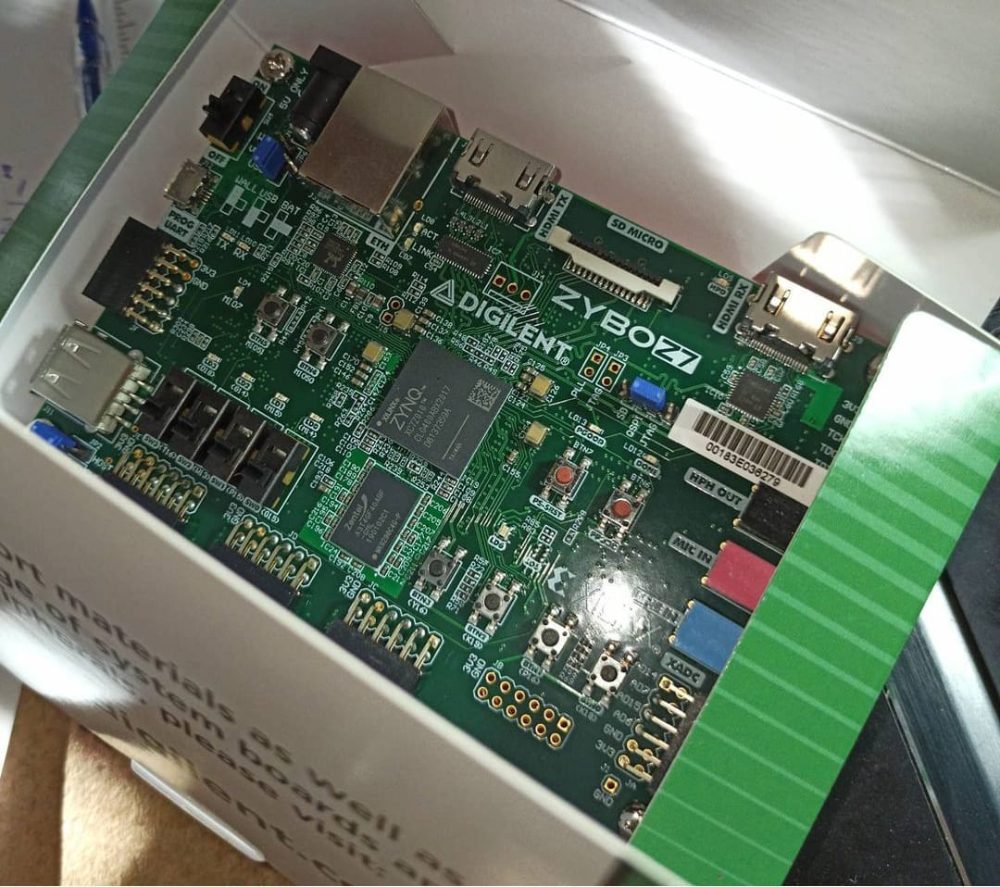
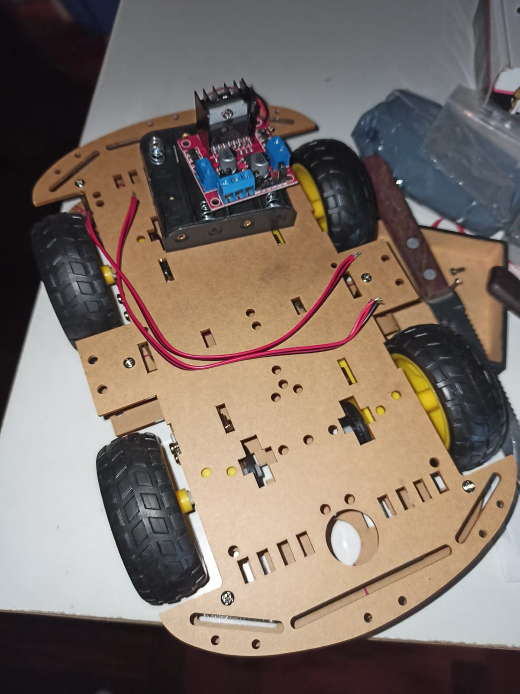
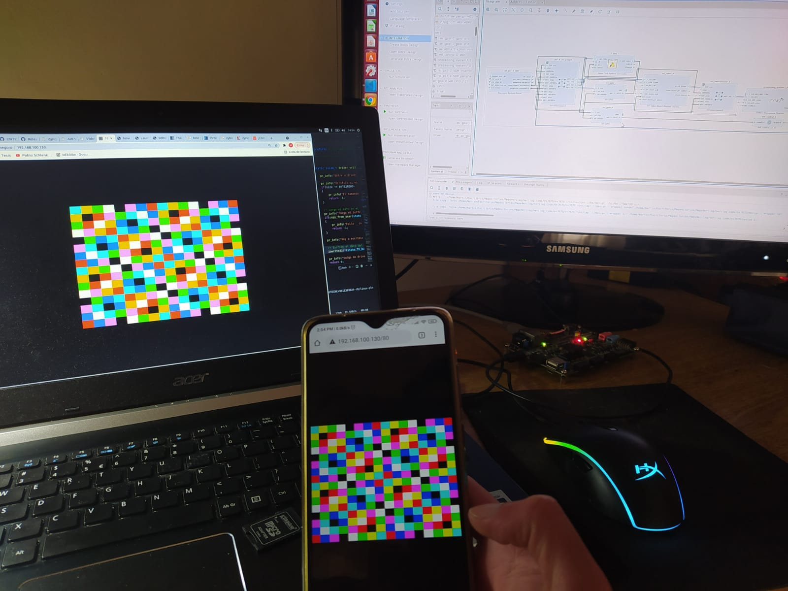
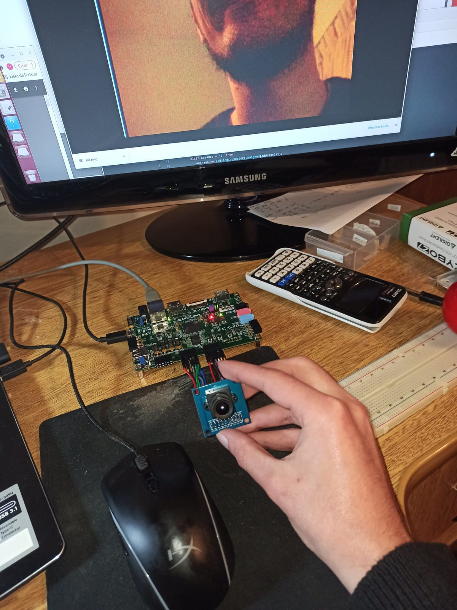
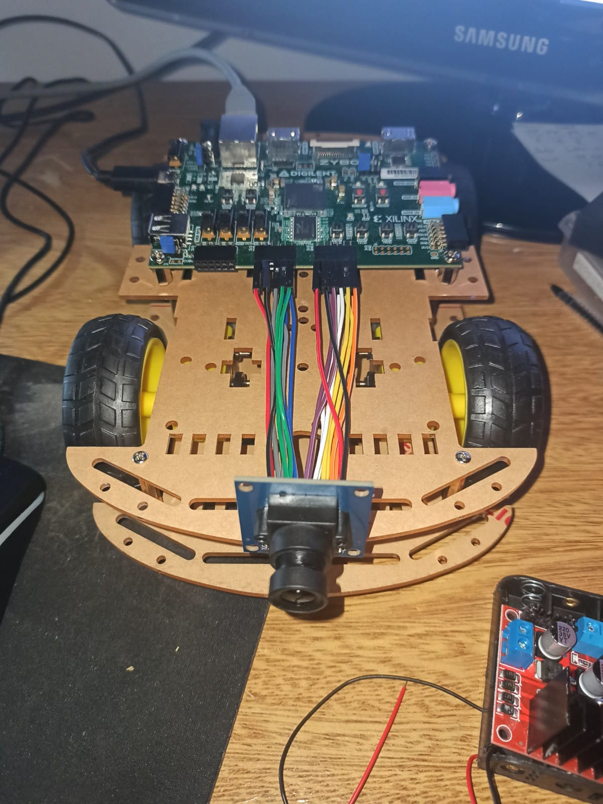
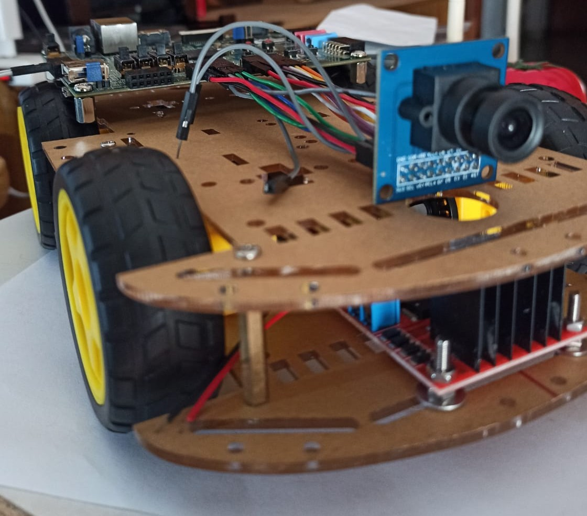
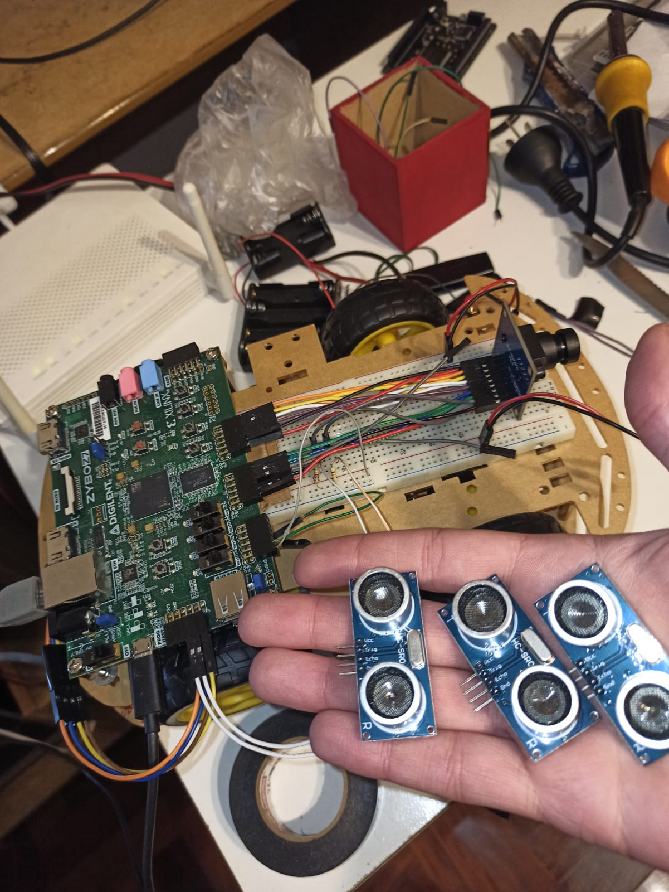
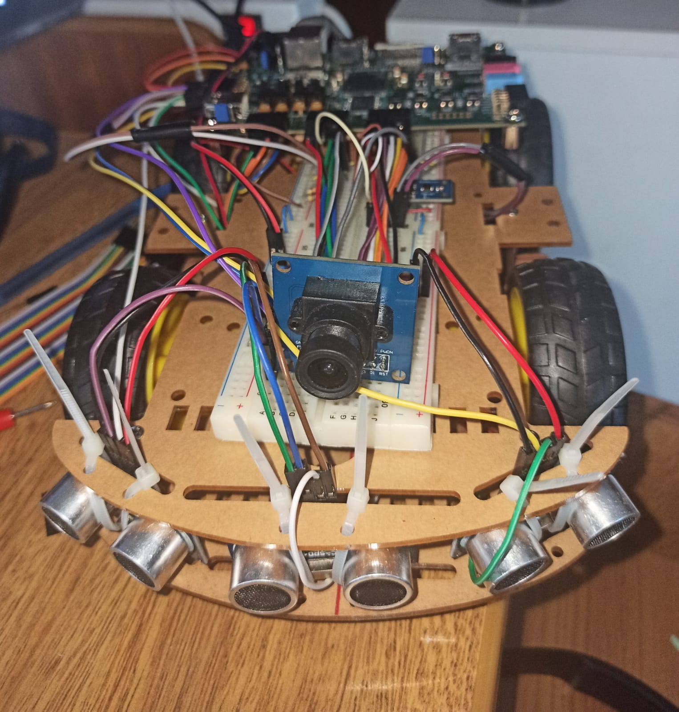

# Sistema de navegacion inteligente acelerado por hardware

## Introduccion 

Este repositorio describe los avances de mi tesis de grado, un sistema de navegacion inteligente acelerado por hardware, su objetivo general es investigar e implementar un sistema nuevo de control basados en lógica difusa y redes neuronales convolucionales para que el robot pueda tomar mejores decisiones a la hora de sortear un obstáculo. Un modulo de redes neuronales convolucionales logrará reconocer un obstáculo, y de este se obtendrán ciertas características y en función de éstas se decidirá en un modulo de sistema de control difuso con distintos tipos de sets de reglas difusas cual de estos sets utilizará el robot para sortear el obstáculo.

### Autor

| Fuschetto Martin         | Email: <marfus@hotmail.es>
|:-------------------------:|:-------------------------:

## Caracteristicas de esta version

* El sistema de procesamiento de imagenes unicamente reconoce un tomate.
* El sistema de control difuso solamente controla la direccion a la cual se dirige el robot para evitar colisionar con el obstaculo.

## Indices

* [Modulo - Procesamiento de imagenes](https://github.com/Fuschetto97/Tesis/tree/main/pImagen)
* [Modulo - Sistema de control difuso](https://github.com/Fuschetto97/Tesis/tree/main/FuzzyControl)
* [Implementacion](https://github.com/Fuschetto97/Tesis/tree/main/Petalinux_Projects)

# Como usar?

0) echo system.bin > /sys/class/fpga_manager/fpga0/firmware
1) insmod Tesis/Drivers/driver_i2c_PS_ov7670.ko && insmod Tesis/Drivers/driver_vdma.ko
2) ./Tesis/Apps/ControlVdma 
3) New Console: cd Tesis/final/sqzdet_c/ && ./main.bin 
4) python Tesis/ServidorPNG/pngserver_ShowCNN.py
5) insmod Tesis/Drivers/driver_MIOgpio_PS.ko && insmod Tesis/Drivers/driver_pwm_EMIOgpio_PL.ko && insmod Tesis/Drivers/driver_EMIOgpio_PL.ko && insmod Tesis/Drivers/driver_i2c_PS_hmc5883L.ko && rmmod Tesis/Drivers/driver_i2c_PS_hmc5883L.ko && insmod Tesis/Drivers/driver_encoder_EMIOgpio_PL.ko
7) New console : ./Tesis/develop/readSTATE.bin
6) ./Tesis/Apps/usrSpace_top & disown && ./Tesis/develop/FuzzyControl.bin & disown && ./Tesis/Apps/usrSpace_drive & disown

## Matriz de requisitos (act. 29/12/2021)

## Fotos

    
    
    
     
    
    
    
    
    
    

## Resuelto

0) Comprar sensores de distancia y escribir drivers.
1) Quitar la red del framework y sus pesos, escribirla en python.
2) Escribir en C la red.
3) Movimiento del robot (Tiempo=1 mes)
    * motores y sus drivers) 
    * Comprar sensor para medir distancia recorrida y escribir driver.
    * Para poder modificar su velocidad pwm en FPGA y su driver. (probar ILA si es necesario)
    * Comprar brujula y escribir su driver. (para conocer la direccion a la que se desplaza)
4) Comprar fuente dc-dc 5v al menos 1.5A para alimentar externamente la Zybo.
5) Crear un archivo en donde se mantenga actualizada toda la informacion de los drivers, direccion del robot, velocidad del robot, distancia por recorrrer para llegar al target, sensores de distancia, etc. A PARTIR DE AQUI LLAMADAS VARIABLES DE ESTADO DEL ROBOT
6) A partir de la red neuronal escribir las variables de estado.
7) A partir de las variables de estado controlar los motores del robot.
8) Escribir el sistema de control difuso en C.
9) Mejorar encoder.

## Pendientes 

1) Aplicaciones (sistema difuso + procesamiento de imagenes).
2) El sistema de control difuso es capaz de dirigirse a un punto especifico evitando colisionar.
3) El robot es capaz de modificar su comportamiento al reconocer distintos obstaculos.

### Proxima version del robot

0) Mejorar rendimiento de la CNN.
1) Desarrollo en la FPGA y su driver.
2) A partir de las variables de estado controlar la velocidad del robot.
3) Convertir el archivo a una shr mem, para poder loggear las variables de estado.