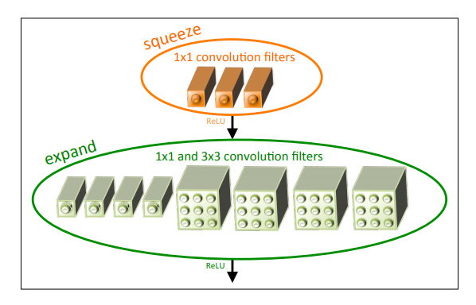
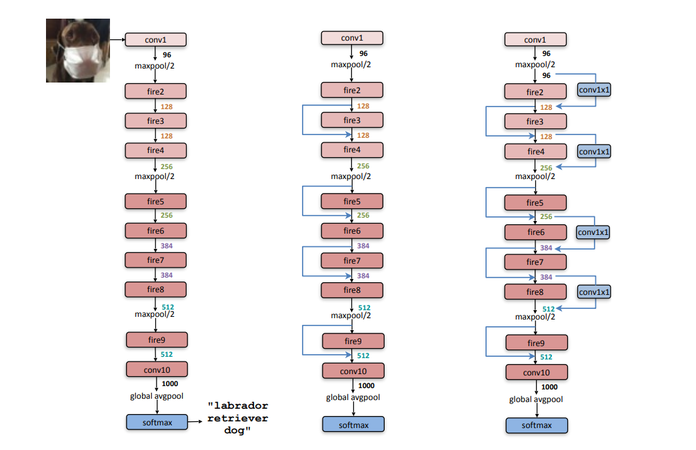

<h1 align="center"> Implementación y entrenamiento (y quiza compresión) de una Red Neuronal Convolucional SqueezeNet </h1> 

# Introduccion 

A lo largo de los años se ha logrado ir aumentando la precisión de las redes neuronales convolucionales con distintos tipos de arquitecturas a tal punto en el que hoy en día se pueden encontrar distintas arquitecturas que cumplan un nivel de precisión que se necesite.

Dado cierto nivel de precisión es muy útil tener una arquitectura de CNN (convolutional neural network) con menos parámetros. 

* Los FPGA a menudo tienen menos de 10 MBytes de memoria en chip y no tienen memoria o almacenamiento fuera del chip. Un modelo suficientemente pequeño podría almacenarse directamente en la FPGA, mientras que los fotogramas de vídeo se transmiten a través de la FPGA en tiempo real.

* Cuando se habla de entrenamiento distribuido, la carga de trabajo para entrenar el modelo se divide y se comparte entre varios procesadores llamados nodos de trabajo para acelerar y/o paralelizar el entrenamiento. En estos casos tener redes mas pequeñas ayuda a que este tipo de entrenamiento sea aun mas eficiente con la ventaja de que la performance de la red no se ve afectada.

* Empresas como Tesla copian periódicamente nuevos modelos de sus servidores a los productos de sus clientes (autos), al trabajar con redes mas pequeñas el gasto de exportar estos modelos se vería relativamente disminuido.

## SqueezeNet Architecture
    
El objetivo general del paper de la SqueezeNet fue lograr un modelo que tenga muy pocos parámetros y al mismo tiempo mantenga la precisión, para lograr esto lo que se hizo fue a partir de un modelo dado se lo logro comprimir con ciertas perdidas. 

* Estrategia 1: Remplazar los filtros 3x3 con filtros 1x1. Estos tienen 9 veces menos parámetros.
* Estrategia 2: Siendo la cantidad total de parámetros en una CNN con filtros de 3x3 = (números de canales de entrada)*(numero de filtros)*(3x3) se busca reducir estos, reduciendo los números de canales de entrada, usando capas de compresión que se describen mas adelante.
* Estrategia 3: Disminuir la resolución al final de la red para que las capas de convolución tengan mapas de activación grandes. Normalmente la reducción de resolución se diseña en arquitecturas de CCN al establecer el step>1 en algunas de las capas de convolución o agrupación.

## Microarchitecture

La micro-arquitectura hace referencia a las capas individuales y los módulos. La operación de convolución ha sido utilizada por al menos 25 años en las CNN. 
Cuando el desarrollo de las CNN se aplica a imágenes típicamente los filtros de la CNN tienen 3 canales en su primer layer (ej,RGB) y en cada layer siguiente los filtros tienen el mismo numero de canales que el numero de filtros que tuvo la layer anterior. 
Al diseñar CNN muy profundos, se vuelve tedioso el hecho de estar seleccionando manualmente las dimensiones del filtro, para abordar esto se propuse varios bloques de construcción de nivel superior, o módulos, que luego se combinan para formar una red completa. 

## The Fire module

Este modulo permite alcanzar las 3 estrategias. Un "Fire Module" se compone de una capa de convolución de compresión (solo tiene filtros de 1x1) que se alimenta a una capa de expansión que tiene una mezcla de filtros de convolución de 1x1 y 3x3 ver figura. El uso de los filtros 1x1 en este modulo es con el propósito de satisfacer la *Estrategia 1*. 

Se exponen 3 hiperparámetros dentro del modulo s1x1, e1x1 y e3x3. En donde: 

* s1x1: Cantidad de filtros en la capa de compresión (todos 1x1). 
* e1x1: Cantidad de filtros en la capa de expansión (todos 1x1).  
* e3x3: Cantidad de filtros en la capa de expansión (todos 3x3).

Cuando usamos un "Fire Module" configuramos s1x1 para que sea menor que (e1x1 + e3x3) por lo que la capa de compresión ayuda a limitar el numero de canales de entrada a los filtros 3x3 *Estrategia 3*.

## Macroarchitecture

La macro-arquitectura se refiere a la organización del nivel de organización del sistema de múltiples módulos dentro de la arquitectura completa de la CNN.

En la figura se puede ver la arquitectura de la SqueezeNet. Comienza con una capa de convolución independiente (conv1) seguida de 8 "Fire Modules" y termina con otra capa de convolución independiente. Gradualmente se aumenta el numero de filtros por "Fire Module" desde el principio de la red al final. Ademas realiza un max-pooling con un stride de 2 despues de las layers conv1, fire4, fire8 y conv10. Las ubicaciones de estos pooling hacen referencia a la *Estrategia 3*.

Otra gran ventaja de esta red es que es susceptible de compresión. En donde combinando grandes técnicas de compresión como "Deep Compression" y la arquitectura de la SqueezeNet se logran reducciones de modelo de hasta 510x veces.

El objetivo de este trabajo es entonces lograr el entrenamiento de una SqueezeNet comprimida, con un dataset propio y escribir su implementación en C para poder implementarla en una placa de desarrollo Zybo sobre un SoC Zynq-7000. Con la motivación de estudiar su posible implementación, o acelerado en la FPGA del mismo SoC. 

# Desarrollos

* [Entrenamiento](https://github.com/Fuschetto97/Tesis/blob/main/pImagen/SqueezeDetTraining/README_Des1.md)

    

